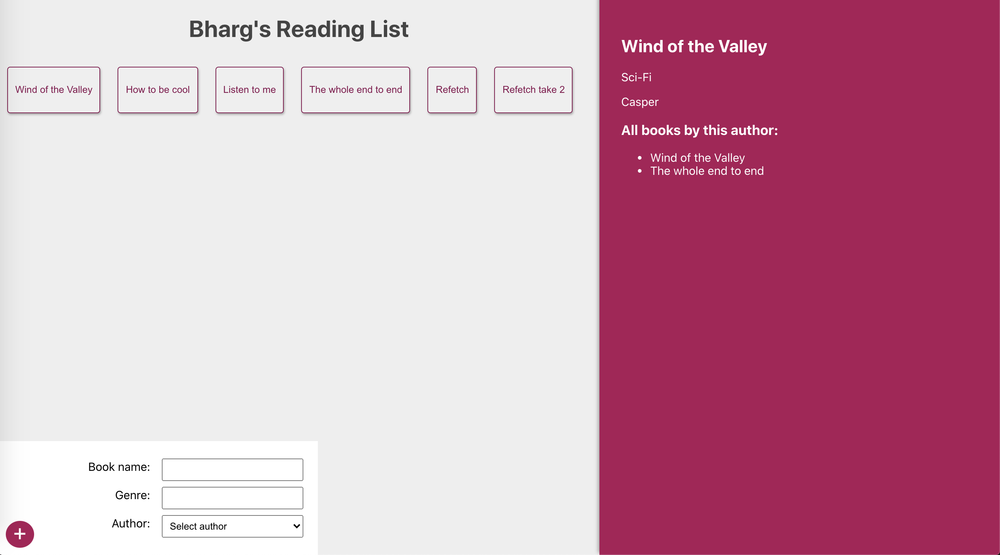

# graphql-playlist



## To run the graphql server

```bash
cd server \
nodemon app
```

## To run the react frontend

```
cd client \
nvm use 14.18.2 \
yarn start
```

## Example GraphQL queries

### Fetch all authors and their books

```
{
  authors{
    name,
    age
    books{
      name,
      id
    }
  }
}
```

### Fetch all books and their authors

```
{
  books{
    name,
    genre,
    author {
      name,
      age
    }
  }
}
```

### Fetch a book with id

```
{
  book(id: "61a820e00c2c6203fbdfa22c"){
    name
    genre
    author{
      name
      age
    }
  }
}
```

### Add a book (not using frontend)

```
mutation{
  addBook(name: "Listen to me", genre: "Advice", authorId: "61a6ef2f1b0e122f29052fb8"){
    name
    genre
    author{
      id
    }
  }
}
```
